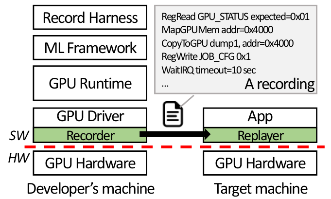
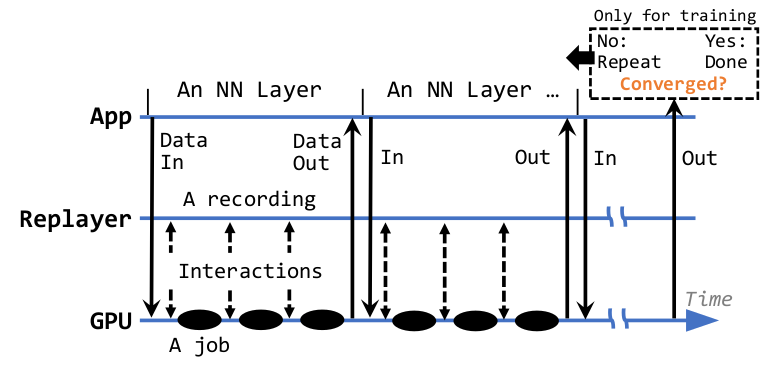

# GPUReplay

GPUReplay is a novel approach to deploy GPU-accelerated computation on mobile and embedded devices which have integrated GPUs. The approach is based on record and replay of GPU executions.

### Overview

<figure>
    <center>
    
         <figcaption> <b>The overview of GPUReplay</b> </figurecaption>
    </center>
</figure>
The developers capture GPU executions on the full GPU stack as a `recording` ahead of time; to reproduce GPU executions, a replayer on target devices runs with the `recording` with new inputs at run time. 
To capture all the needed information GPUReplay requires to lightly instrument the GPU device drivers, 
while leaving the userspace GPU runtime and the GPU apps unmodified. 
The current code release comprises a modified GPU driver (for the Arm Bifrost GPUs) and a userspace replayer.

# Installation

NB: GPUReplay has been tested on Hikey960 with a Mali G71 GPU. We recommend you to use the same platform to avoid unexpected errors/bugs.

### GPU register access from userspace

As a prototype, GPUReplay currently uses `devmem` to access physical memory directly. If you want to know more about `devmem`, read the [post](https://bakhi.github.io/devmem/). NB: if you are running a prebuilt kernel image, you may not able to use devmem as the operation is not permitted by default. To use it, you need to disable CONFIG_STRICT_DEVMEM in the kernel configuration and build your own image to load.

### Build and install Mali device driver

```shell
# go to the midgard directory
$ cd Bifrost-kdriver/driver/product/kernel/drivers/gpu/arm/midgard

# check out the configurations
# modify it as you like and run to build
$ ./build.sh
```

### Userspace replayer

```shell
# go to the replayer directory
$ cd replayer
$ source env.sh
$ config-gr
$ build-rls	# build replayer
$ build-mod-rls # nano driver
```

## Record

To record GPU execution, build and load the provided GPU driver and run a record harness (your GPU app). The driver then automatically dumps all the necessary information through files as `recordings` (i.e. register I/O history, page table, memory contents, and synced address spaces).

**NB:** By design, GPUreplay allows only one GPU context. Once the trace is dumped, it is required to reload a device driver, e.g. for a new recording, remove the currently loaded device driver (`rmmod`), and load it again (`insmod`).

We mainly use the [ARM Compute Library](https://github.com/ARM-software/ComputeLibrary) to test GPUReplay that includes a variety of NN inference examples running on either OpenCL or GLES. Refer to [Hikey960 with ACL](https://developer.arm.com/documentation/ecm0752397/ac/Build-the-Arm-Compute-Library-on-HiKey-960) if you want to produce a recording with ACL.

## Replay

The replayer maps the physical memory for register I/O to its virtual memory by `mmap()`. It defines  `GPU_REG_PA_START`, a start physical address where GPU registers are mapped. 
Replace it with the one corresponding to your target device. 
By default, Hikey960 uses `0xE82C000`. If you are not using Hikey960, checkout the device tree for your target platform or look into `/proc/iomem` to get an appropriate range of physical memory the GPU register are mapped.

When your recordings are ready, you can run the replayer to reproduce the GPU computation. 
You can load a new input for replaying.

<figure>
    <center>
    
         <figcaption> <b>Replaying NN execution with GPUReplay</b> </figurecaption>
    </center>
</figure>

Depending on the recording granularity, you may need to replay recordings multiple times to reproduce the entire computation. In the mean time, you can run CPU computations on the replay results.

**NB**: before you run the replayer, make sure you unload the stock GPU driver; you should load the replayer kernel that manages GPU memory and interrupts. When you run the replayer, you may need the sudo privilege as the replayer need such a permission to access devmem.

## Worth reading

[Hacking mobile GPU](https://bakhi.github.io/mobileGPU/): document our experience on mobile GPU architecture and driver hacking.

[GPUReplay: A 50-KB GPU Stack for Client ML](https://arxiv.org/abs/2105.05085) in Proc. ASPLOS 2022

## Licenses

The Mali device driver [](https://www.gnu.org/licenses/old-licenses/gpl-2.0.en.html)

The GPUReplay replayer [](https://opensource.org/licenses/BSD-2-Clause)

# Disclaimer

This is a research prototype and we do not guarantee its use or stability. Use at your own risk.

# People

This project is leaded by the XSEL research group.

[Heejin Park](https://bakhi.github.io/), Purdue University

[Felix Xiaozhu Lin](https://fxlin.github.io/), University of Virginia (formerly at Purdue) 